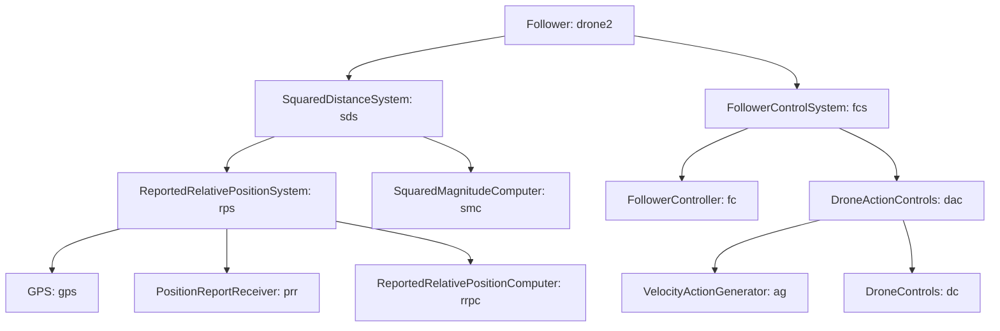
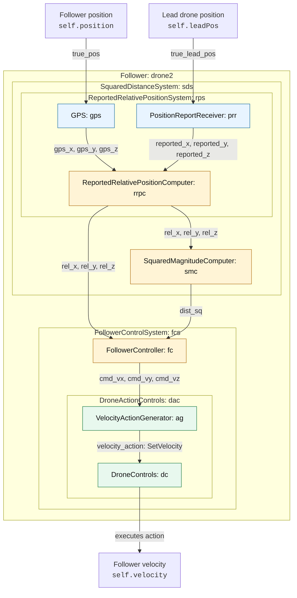
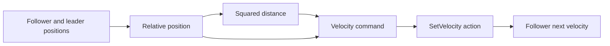
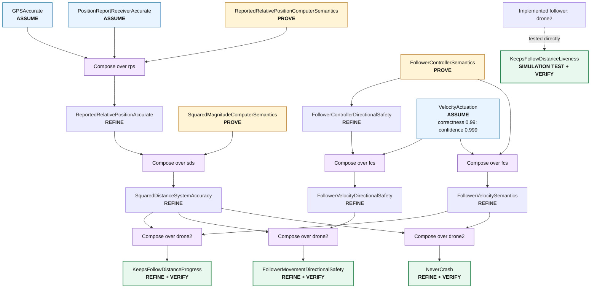
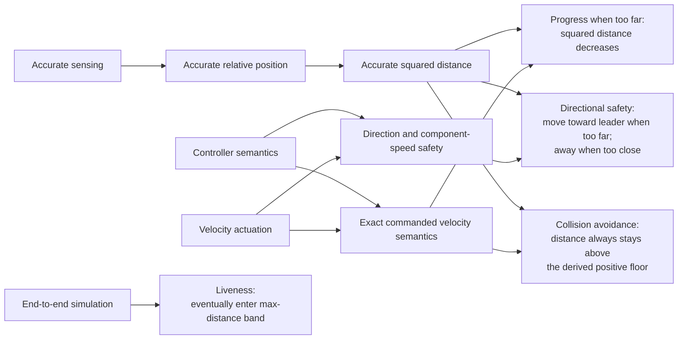

# Drone-distance diagrams

These diagrams summarize the components and verification steps defined in
[`drone_distance.contract`](./drone_distance.contract).

Coverage audit: the source contains **12 component declarations**, **31 explicit
connections**, **15 contract declarations**, and **27 verification-step
statements** (including the four final `verify` statements). Every declared
component and contract is represented below. To keep the diagrams readable,
parallel `x`, `y`, and `z` connections are grouped into a single labeled arrow,
and passthrough connections at composite boundaries are not drawn as separate
nodes.

## Component containment

This tree shows the composition structure independently of signal flow.

There are no other standalone components after removal of the unused
`VelocityEstimator`.

## Component composition and data flow

The main signal path is:

## Contract composition, proof, and refinement

## What the contracts establish

The directional-safety and progress refinements additionally assume the position integration
law. Progress also assumes a bounded leader displacement and that the follower's
minimum approach speed exceeds the leader's maximum speed.
The collision-avoidance refinement instead uses the exact velocity semantics. It
assumes a stronger retreat gain whose radial speed beats the leader down to the
derived floor, an inactive retreat clamp, and a far-zone no-overshoot margin.
